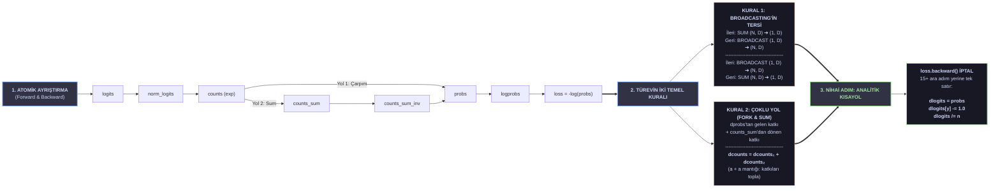

```mermaid
graph LR
    %% 1. BÖLÜM: ATOMİK AYRIŞTIRMA
    B1["<b>1. ATOMİK AYRIŞTIRMA</b><br/>(Forward & Backward)"]
    L["logits"]
    NM["norm_logits"]
    C["counts (exp)"]
    CS["counts_sum"]
    CSI["counts_sum_inv"]
    P["probs"]
    LP["logprobs"]
    LOSS["loss = -log(probs)"]

    B1 --> L
    L --> NM
    NM --> C
    C -->|Yol 1: Çarpım| P
    C -->|Yol 2: Sum| CS
    CS --> CSI
    CSI --> P
    P --> LP
    LP --> LOSS

    %% 2. BÖLÜM: İKİ TEMEL KURAL
    B2["<b>2. TÜREVİN İKİ TEMEL KURALI</b>"]
    K1["<b>KURAL 1: BROADCASTING'İN TERSİ</b><br/>İleri: SUM (N, D) ➔ (1, D)<br/>Geri: BROADCAST (1, D) ➔ (N, D)<br/>-----------------------------------<br/>İleri: BROADCAST (1, D) ➔ (N, D)<br/>Geri: SUM (N, D) ➔ (1, D)"]
    K2["<b>KURAL 2: ÇOKLU YOL (FORK & SUM)</b><br/>dprobs'tan gelen katkı<br/>+ counts_sum'dan dönen katkı<br/>-----------------------------------<br/><b>dcounts = dcounts₁ + dcounts₂</b><br/>(a + a mantığı: katkıları topla)"]

    LOSS ==> B2
    B2 --> K1
    B2 --> K2

    %% 3. BÖLÜM: ANALİTİK KISAYOL
    B3["<b>3. NİHAİ ADIM: ANALİTİK KISAYOL</b>"]
    SC["<b>loss.backward() İPTAL</b><br/>15+ ara adım yerine tek satır:<br/><br/><b>dlogits = probs</b><br/><b>dlogits[y] -= 1.0</b><br/><b>dlogits /= n</b>"]

    K1 ==> B3
    K2 ==> B3
    B3 --> SC

    %% RENK VE STİLLER
    style B1 fill:#313244,stroke:#89b4fa,stroke-width:2px,color:#cdd6f4
    style B2 fill:#313244,stroke:#89b4fa,stroke-width:2px,color:#cdd6f4
    style B3 fill:#313244,stroke:#a6e3a1,stroke-width:2px,color:#a6e3a1
    style SC fill:#181825,stroke:#a6e3a1,stroke-width:2px,color:#cdd6f4
    style K1 fill:#181825,stroke:#fab387,stroke-width:1px,color:#cdd6f4
    style K2 fill:#181825,stroke:#fab387,stroke-width:1px,color:#cdd6f4
```